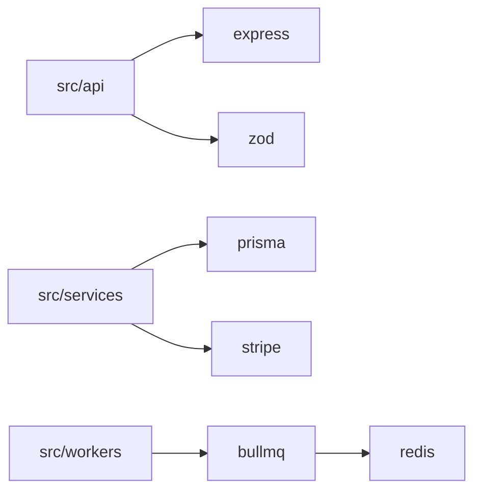

# Prompt: Generate DEPENDENCIES.md

You are a senior engineer doing a dependency audit. I have just cloned this repository. Produce a single file `docs/DEPENDENCIES.md` that answers three questions for every dependency: **what is it, why is it here, and what would break if we removed it.**

This document serves two audiences: (1) a future LLM session that needs to reason about the project's external surface area, and (2) an engineer evaluating upgrades, replacements, or supply-chain risk.

## Step 1 — Discover
Inspect the repo's dependency declarations:
- `package.json` + lockfile (`package-lock.json`, `yarn.lock`, `pnpm-lock.yaml`)
- `pyproject.toml` / `requirements*.txt` / `Pipfile` / `poetry.lock`
- `go.mod` / `go.sum`
- `Cargo.toml` / `Cargo.lock`
- `pom.xml` / `build.gradle` / `composer.json` / `Gemfile`
- `Dockerfile`, `docker-compose.yml` for system-level deps
- `.github/workflows/*` for CI-time deps
- Any vendored code under `vendor/`, `third_party/`, `lib/`

Then **grep the codebase** to confirm each dependency is actually imported. A package listed in the manifest but never imported is a finding worth noting.

## Step 2 — Write `docs/DEPENDENCIES.md` with these sections

### 1. Summary
A short paragraph: total direct dep count, runtime vs dev split, language ecosystems involved, and any immediate red flags (unmaintained packages, duplicate functionality, suspicious version pins).

### 2. Runtime dependencies
A table covering every **direct** runtime dependency:

| Package | Version | Purpose in this project | Used in | Replaceable with | Risk |
|---------|---------|-------------------------|---------|------------------|------|
| `express` | `^4.19.0` | HTTP server | `src/server.ts`, `src/routes/*` | Fastify, Hono | Low — stable, widely used |
| `lodash` | `^4.17.21` | Utility functions (3 used: `debounce`, `groupBy`, `chunk`) | `src/utils/*` | Native ES2023 / `es-toolkit` | Medium — heavy for limited use |

Rules for the table:
- **Purpose** must be specific. Not "utilities" — say *which* utilities.
- **Used in** lists actual file paths or globs where it's imported. If you can't find an import, flag it.
- **Replaceable with** lists realistic alternatives, including stdlib if applicable.
- **Risk** is your judgment: maintenance status, last release, security advisories you can infer, lock-in cost.

### 3. Development dependencies
Same table format, scoped to test/build/lint/typecheck tooling. Group by purpose (testing, linting, building, typing) if it improves readability.

### 4. System & infrastructure dependencies
Anything outside the language package manager:
- Databases (Postgres 15, Redis 7, etc.)
- Message brokers, search engines, object storage
- Required CLIs (`ffmpeg`, `imagemagick`, `git`, `make`)
- Base Docker images and what they bring
- External SaaS APIs the code calls (Stripe, SendGrid, OpenAI, etc.) — note the env var that holds the credential

### 5. Dependency graph (the important edges)
A Mermaid `graph LR` showing how the **major** internal modules depend on the **major** external libraries. Don't draw every edge — draw the ones that matter. The goal is to make "if we replaced X, what would we touch?" visually obvious.

Example:

### 6. Why each major choice was made
For the load-bearing dependencies (the ones whose removal would require a rewrite), one paragraph each: the role it plays, why it was likely chosen over alternatives, and what the migration cost would look like. Infer from code patterns and comments — if you're guessing, say so.

### 7. Findings
A bulleted list of concrete observations. Examples:
- Unused: `package-X` is in the manifest but no file imports it.
- Duplicated capability: `moment` and `date-fns` are both present.
- Outdated major: `package-Y` is pinned to v3 while v6 is current; note breaking changes if known.
- Security-sensitive: `package-Z` parses untrusted input; flag for extra scrutiny.
- Pinned via lockfile only: direct dep with floating range — reproducibility risk.
- Transitive surprise: a notable transitive dep worth knowing about (e.g. `node-gyp`, native bindings).

### 8. Upgrade & replacement notes
For each finding above that warrants action, a one-line suggested next step. Don't write migration code — point at the decision.

### 9. Open questions
Things you couldn't determine from the code:
- Why was X chosen over the obvious alternative Y?
- Is the pin on `package@1.2.3` deliberate or accidental?
- Is `vendored/foo/` a fork, and if so, what was changed?

## Constraints
- Cover **direct** dependencies exhaustively. Mention transitives only when they're notable.
- Every "Used in" claim must reference a real file. If grep returns zero hits, that *is* the finding.
- Don't invent CVEs or security claims. Stick to what's verifiable from the code and manifest.
- Prefer tables over prose. This document will be skimmed, not read.
- Keep it under ~500 lines. Long tables are fine; long paragraphs aren't.
- Output the file content only — no preamble.